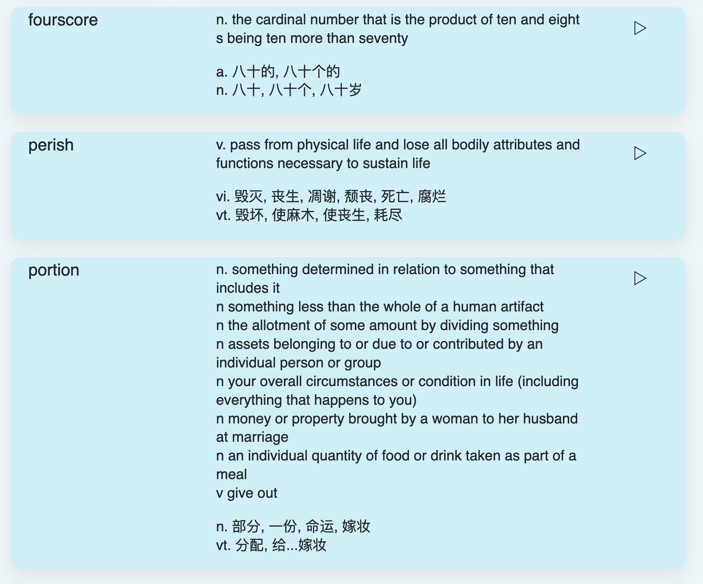
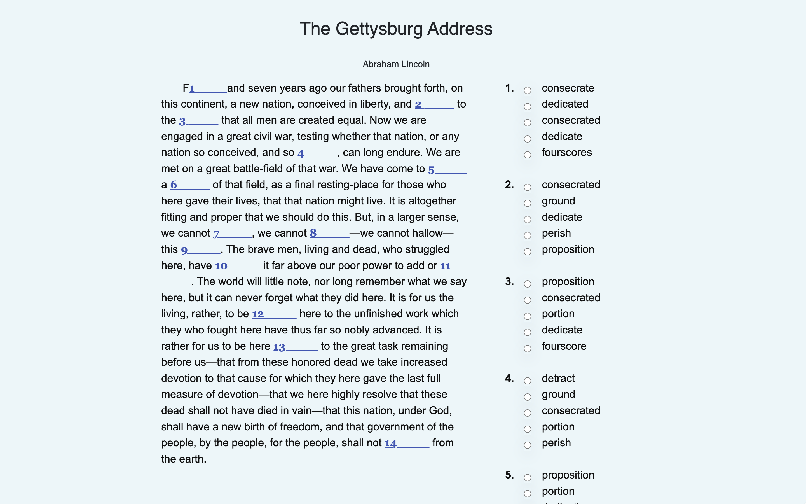
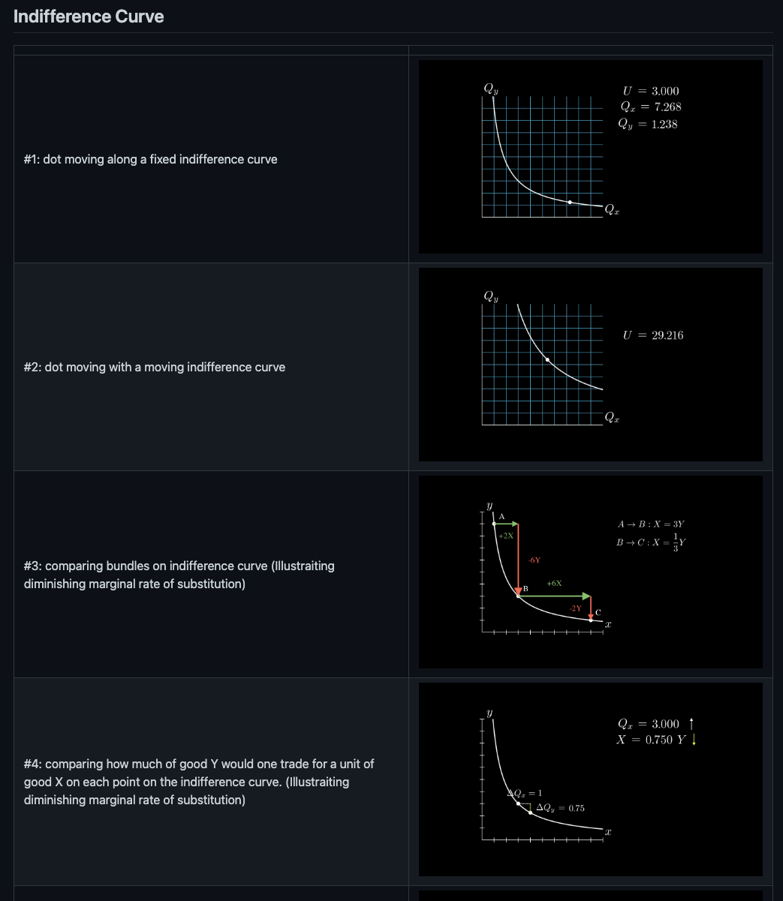
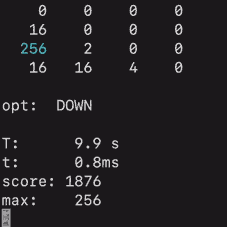

# Hey, I'm Aden

I'm a first-year undergraduate student at UChicago, studying Economics and Mathematics. The following are a few of my more interesting projects. Clicking on the project names leads you to their corresponding Github repository.

## [Ex Libris](https://github.com/uExLibris/uExLibris.github.io)

I have very recently started a popular science media with a few of my friends (20+!) named Ex Libris. (The name was appropriated from the name of a cafe located on the first floor of the Joseph Regenstein Library at the University of Chicago.) 

The [website for Ex Libris](https://uexlibris.github.io/) is still in development and has only one demo article that I've written during the past winter break about [framing effect](https://thedecisionlab.com/biases/framing-effect), [transaction utility theory](https://www.acrwebsite.org/volumes/6118/volumes/v10), [scarcity theory](https://en.wikipedia.org/wiki/Scarcity_(social_psychology)) etc.; the demo article was written in Chinese, but most, if not all, future articles will be in English.

## [English Reading Practice Website](https://github.com/AdenChen27/Project_0)

One common challenge in learning English as a second language (at a beginner to intermediate level) that I both experienced personally and observed among peers is the tendency to memorize translations of English words, which makes it difficult to use them appropriately or understand their precise meanings in context due to nuances lost in translation. To address this issue, I tried to develop a new learning model where the learner is presented with new words, learns the new words, and immediately practices using them in context (instead of the common process of reading -> finding new vocabulary -> learning new vocabulary -> remembering only the translation).

[This website](https://adenchen27.pythonanywhere.com/index/) serves as an implementation of the proposed learning model. Users begin by selecting a passage, selecting and learning unfamiliar words within the passage (before being shown the full passage), and then immediately practicing using these newly learned words within the context of the passage via, for example, doing fill-in-the-blank or multiple-choice questions about the newly learned words.

  
  

## [Online APA7 In-Text Citation Checker](https://github.com/AdenChen27/AdenChen27.github.io/tree/main/citation_checker)

During high school, I had to write several essays using APA7 format and was unaware of the existence of LaTeX. I'm familiar with various citation generator tools that assist in creating a reference list (one of which I particularly liked is [Scribbr](https://www.scribbr.com/citation/generator/)), but I could not find any free online tools that can check my in-text citations. In particular, I need a tool that can: 

1. verity the formatting of my in-text citations (because some rules are kind of confusing for beginners), and
2. check whether my in-text citations match my reference list (i.e. each in-text citation has a matching entry in my reference list, and all entries in my reference list has been cited in my essay.)

So I created [one](https://adenchen27.github.io/citation_checker/main.html) using RegExp. It looks extremely primitive (because it is), but it gets the job done (mostly).

## [Econic](https://github.com/AdenChen27/MyMoneyOnMyMind)

Animations about behavioral economics concepts used in Econic, a Wechat Official Account blog I started which publishes articles explaining behavioral economics to the general public.

## [Citation Network](https://github.com/AdenChen27/reference_map)

I tried to visualize the reference lists of some research papers I read as a graph (a node represent a research paper, an edge represent a citation). Here's a [demo](https://adenchen27.github.io/demo_0.html) of what I did. (Of course, this was before I know the existence of [Connected Papers](https://www.connectedpapers.com/), which does a much, much better job.)

## [Online function plotting](https://github.com/AdenChen27/AdenChen27.github.io/tree/main/func_image)

A [webpage](https://adenchen27.github.io/func_image/func_image.html) that plots function images.

## [CTB Website](https://github.com/CHVSG/CHVSG.github.io)

[Website](https://chvsg.github.io/) for a [CTB](https://www.hauscr.org/ctb) project on motivating sports participation among Chinese high school girls.

## [2048 solver](https://github.com/AdenChen27/2048_solver)

## FaceTimelapse

Align faces to produce goofy animations.

