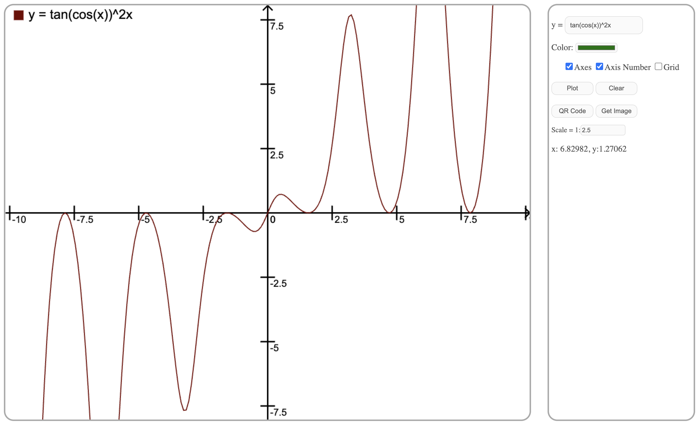
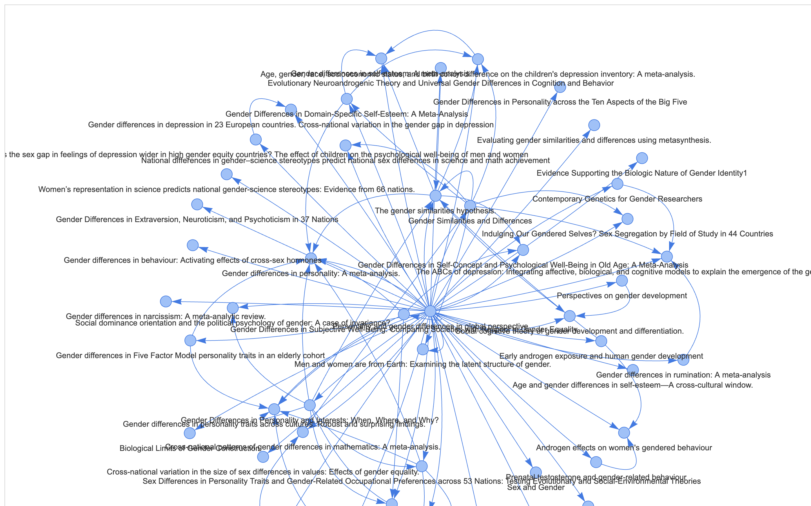
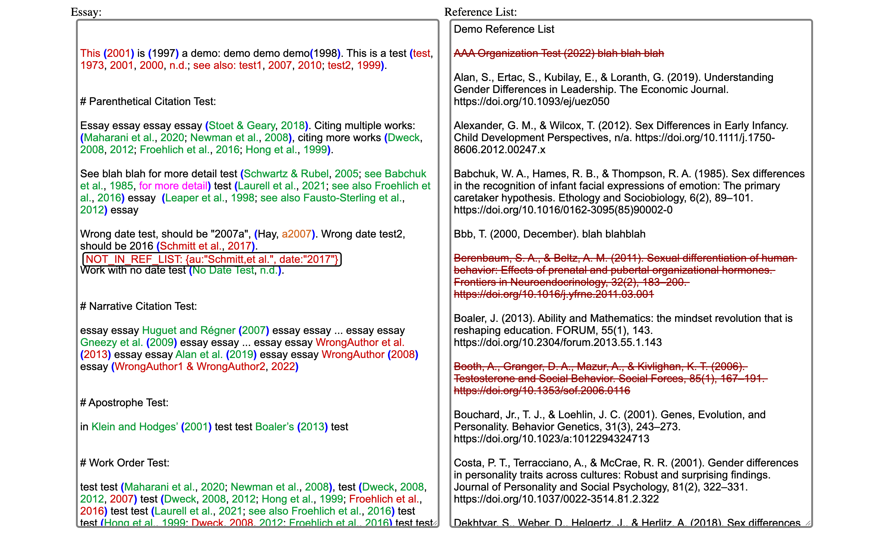

### [Online function plotting](https://github.com/AdenChen27/AdenChen27.github.io/tree/main/func_image)

- [Check it out](https://adenchen27.github.io/func_image/func_image.html)
- It's basic, but hey, it's really fast and extremely lightweight!
- Generates QR code for this page with your plotted function images
    - `qrcode.js` from [davidshimjs](https://github.com/davidshimjs/qrcodejs)
- Get png files in a click so you won't have to take screenshots
- 

### [download metadata from doi and plot citation graph](https://github.com/AdenChen27/reference_map)

- It's useless but kinda cool
- [demo 0](https://adenchen27.github.io/demo_0.html)
- 

### [Online APA7 In-Text Citation Checker](https://github.com/AdenChen27/AdenChen27.github.io/tree/main/citation_checker)

- [Check it out](https://adenchen27.github.io/citation_checker/main.html)
- 

### [2048 solver](https://github.com/AdenChen27/2048_solver)

### [English Reading Practice Website](https://github.com/AdenChen27/Project_0)

### [CTB Website](https://github.com/CHVSG/CHVSG.github.io)

- [Check it out](https://chvsg.github.io/)
- For CTB project on motivating Chinese high school girls to do more sports.

Too old: [VB](https://github.com/AdenChen27/VB_stuff), [timetable](https://github.com/AdenChen27/timetablebuilder)

